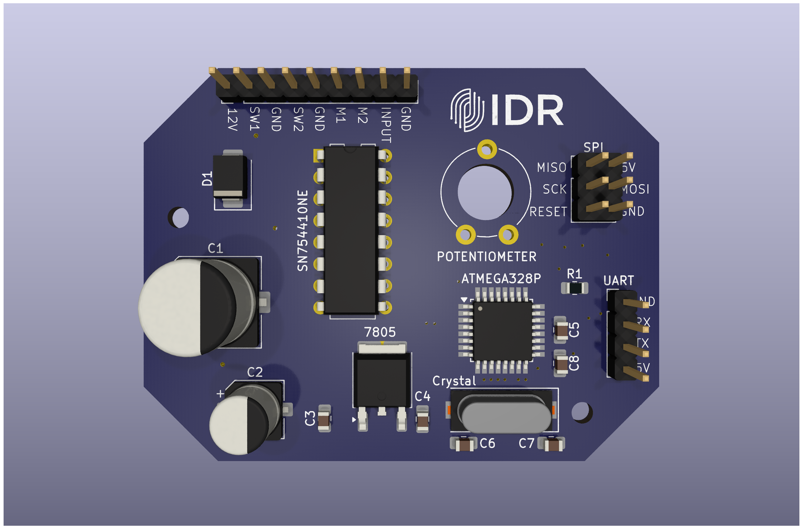

# ServoBallValve

## Overview
This repository contains the code and design (PCB) for the Angled Controlled valve (ServoBallValve) module, which serves as an actuator for dispensing paint in the automatic paint machine. The ServoBallValve is responsible for controlling the flow of paint according to the desired angle.

## Hardware

## Features
- **Positional Control**: Uses a motor in a closed loop system to precisely control the angle of the valve.
- **Flow Regulation**: Regulates the paint flow rate based on the angle setpoint.
- **Sensor Integration**: Utilizes High resolution Potentiometer for position feedback and validation.

## Communication Protocol
The ServoBallValve module receives and sends commands via a predefined protocol:
- `50Hz Signal` - It is the wave carrier for the data.
- `MicroSeconds codification` - The data is codified in the pulse width of the signal by sending a high pulse in the range of 1000 to 2000 microseconds.

## Troubleshooting
| Issue               | Possible Cause                | Solution |
|---------------------|-----------------------------|----------|
| Incorrect positioning| Calibration error           | Re-run calibration sequence |
| No response       | Communication failure       | Verify communication wiring and settings |
| Erratic flow        | Sensor malfunction or misalignment| Check sensor connections and alignment |

## Contributors
- **Paolo Reyes** - Lead Developer

## License
This project is licensed under the MIT License - see the LICENSE file for details.